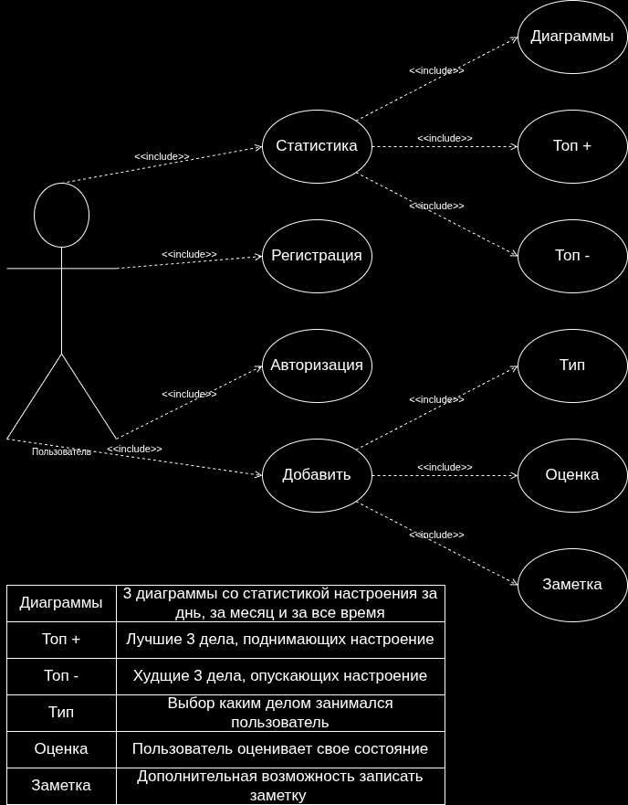
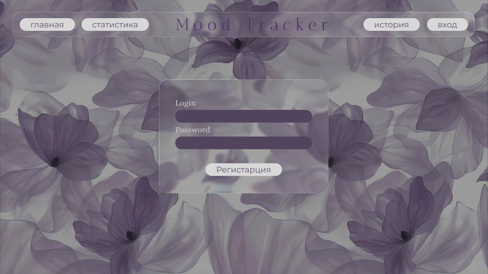
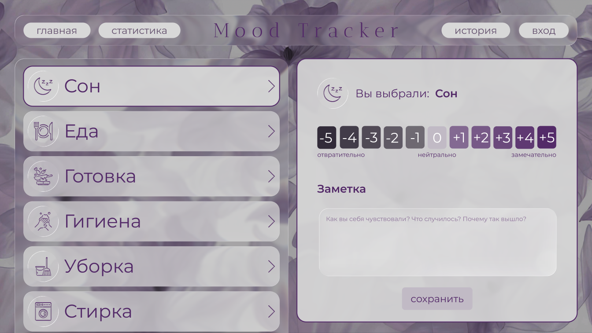
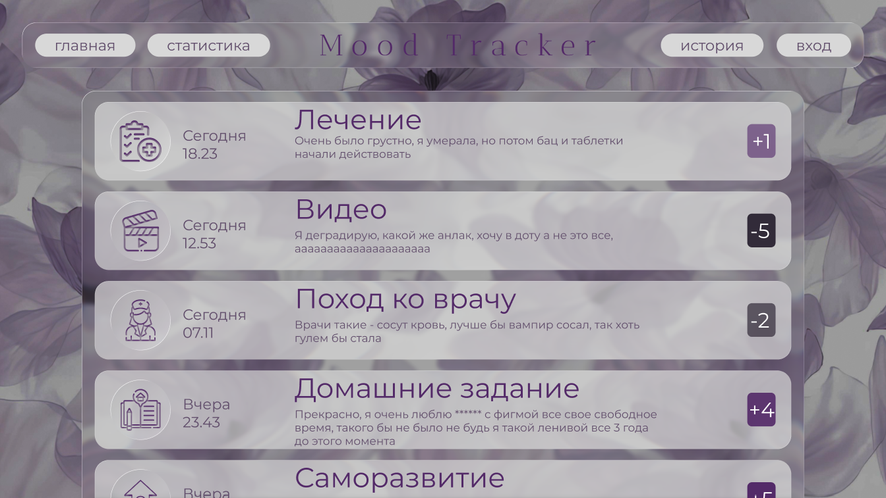

# Трекер изменений настроение при повседневной активности 
##    Описание проекта 
  Проект представляет собой веб сайт для отслеживания повседневных дел пользователя и анализ его эмоций при их выполнение.   
  Пользователь сможет посмотреть статистику и топ своих задач и настроения, а также прошлые заметки. 
##    Актуальность темы
  В условиях нынешнего ритма жизни люди все чаще и чаще сталкиваются со стрессом, выгоранием и снижением продуктивности. Но даже при этом многие не анализируют свое состояние и факторы влияния не него в силу нехватки времени или сложности данного процесса. 
  Этот веб сайт как раз позволяет легко и быстро собирать все данные, не теряя времени на анализ и сбор статистики. А это уже способствует повышению осознанности, улучшению состояния и более эффективному  планированию задач на день с учетом своих особенностей. 
##    Целевая аудитория 
  Вероятно большая составляющая пользователей приложения будет составлять студентов и молодых рабочих с высокой нагрузкой. Также люди заинтересованные саморазвитием и высокоэффективным распределением нагрузки. 
##    Функции и возможности 
 - Регистрация и Авторизация пользователей 
 - Выбор типа активности  
 - Оценка результата активности 
 - Добавление заметок 
 - Хранение и просмотр истории записей
- Формирование статистики за день, за месяц, за весь период времени 
 - Визуализация этих данных в диаграммах
 - Топ 3 лучших занятия поднимающих настроение  
 - Топ 3 худших занятия опускающих настроение 
## Используемые технологии 
 - HTML 
 - CSS 
 - JavaScript
 - React 
 - Python
 - PostgreSQL
## Ожидаемый результат 
  Корректно работающий сайт с удобным интерфейсом и возможностью последующего улучшения. 

## Use-case диаграмма

# Figma
## Страница регистрации 

## Страница входа 

## Страница статистика 

## Страница выбора 

## Страница истории 

